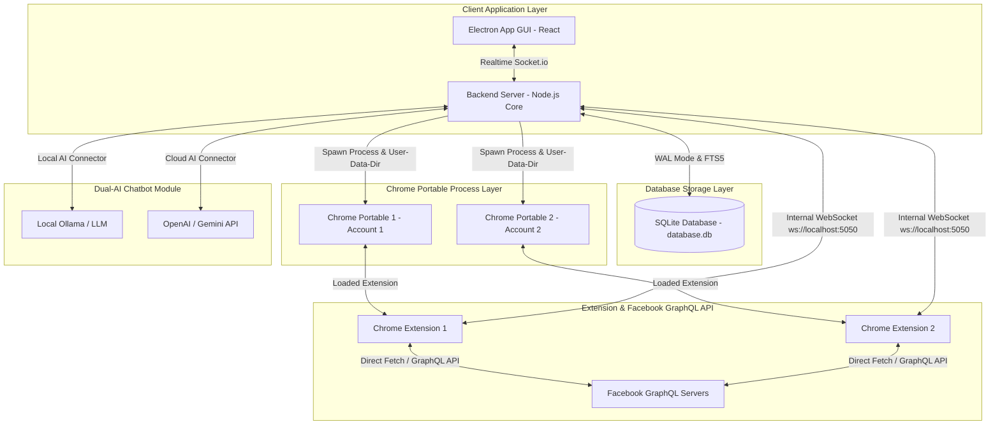
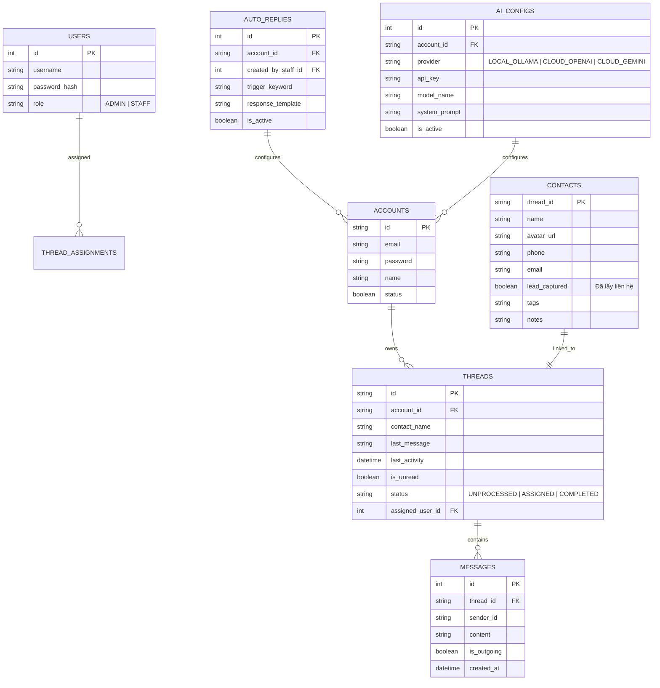

# Kế Hoạch Chi Tiết Phát Triển Hệ Thống FB Personal Messenger CRM

Tài liệu này xác lập kế hoạch triển khai toàn diện bao gồm: **Techstack công nghệ**, **Kiến trúc hệ thống**, **Mô hình CSDL SQLite**, **Chi tiết tính năng** và **Lộ trình phân chia theo các Sprint nhỏ**.

---

## 1. Công Nghệ Sử Dụng (Techstack)

| Thành phần | Công nghệ đề xuất | Vai trò & Lý do lựa chọn |
| :--- | :--- | :--- |
| **Engine Facebook** | **Chrome Portable + Extension (Manifest V3)** | Chạy trình duyệt Chrome thật 100% (An toàn không lo Checkpoint). Extension gọi trực tiếp GraphQL API của Facebook siêu tốc (< 0.2s). |
| **Backend Core** | **Node.js (Express)** | Xử lý logic nghiệp vụ, quản lý khởi động các tiến trình Chrome Portable ngầm qua `child_process`. |
| **Realtime Engine** | **Socket.io & Local WebSocket** | Kết nối 2 chiều giữa Extension <-> Backend (`ws://localhost:5050`) và Backend <-> Dashboard UI. |
| **Database** | **SQLite (better-sqlite3)** | CSDL lưu dạng file `.db` duy nhất. Bật **WAL Mode** (đọc/ghi song song) + **FTS5** (tìm kiếm văn bản 1,000,000 tin nhắn trong 20ms). Zero-config, cực nhẹ và dễ đóng gói. |
| **Frontend UI** | **React (Vite) + TailwindCSS** | Giao diện Single Page Application (SPA) hiện đại, mượt mà, phản hồi tức thì. |
| **Dual-AI Engine** | **Local Ollama & Cloud OpenAI / Gemini API** | Linh hoạt chuyển đổi giữa AI chạy local trên máy (miễn phí, riêng tư) và AI Cloud (mạnh mẽ). |
| **Đóng gói Desktop** | **Electron** | Bọc Backend + Frontend + Chrome Portable thành file cài đặt `.exe` duy nhất trên Windows. |
| **Bảo mật Source Code** | **`bytenode` + `javascript-obfuscator`** | Biên dịch Backend Node.js sang V8 Bytecode nhị phân `.jsc` + Làm rối code Chrome Extension. |

---

## 2. Kiến Trúc Hệ Thống & Luồng Dữ Liệu

---

## 3. Mô Hình Cơ Sở Dữ Liệu SQLite (Database Schema)

---

## 4. Chi Tiết Các Tính Năng Chức Năng

1. **Quản lý Đa Tài khoản Facebook:**
   - Đăng nhập & lưu trữ Session độc lập trong `data/profiles/account_id`.
   - Bật/Tắt ngầm từng tài khoản, xem trạng thái kết nối real-time.
2. **Phân quyền Nhân viên & Hệ thống Tabs phân luồng:**
   - Nhân viên xem được tất cả tin nhắn để phối hợp công việc.
   - Tabs phân loại: *Tất cả tin nhắn*, *Được phân công (Assigned)*, *Chưa xử lý (Unprocessed)*, *Đã chốt (Completed)*.
   - Nhân viên cấu hình kịch bản Tự động trả lời / AI cho phân khúc nhóm khách hàng phụ trách.
3. **Giao diện Chat Tập trung (3 Panels):**
   - Panel trái: Danh sách hội thoại + Nhãn phân công/chưa đọc.
   - Panel giữa: Khung chat mượt mà, trả lời tức thì qua GraphQL API.
   - Panel phải: Tự động trích xuất SĐT/Email bằng Regex + Nút "Đánh dấu lấy được liên hệ" + Ghi chú/Tag.
4. **Tìm kiếm FTS5 & Xuất dữ liệu Khách hàng:**
   - Tìm kiếm từ khóa trong hàng triệu tin nhắn chỉ mất 15-30ms nhờ SQLite FTS5.
   - Lọc danh sách Lead thu thập được và xuất file Excel / CSV.
5. **Tự động trả lời & Broadcast cá nhân hóa:**
   - Auto-reply khi khách nhắn lần đầu hoặc theo từ khóa.
   - Broadcast gửi tin nhắn hàng loạt kèm biến cá nhân hóa (`{ten_khach_hang}`, `{sdt}`, `{thoigian}`) + Giãn cách an toàn ngẫu nhiên (15s - 45s).
6. **Tích hợp Dual-AI Chatbot:**
   - Chuyển đổi linh hoạt giữa Local AI (Ollama) và Cloud AI (OpenAI / Gemini API).

---

## 5. Lộ Trình Triển Khai Chi Tiết Theo Sprint (Roadmap)

### 🚀 Sprint 1: Khởi Tạo Core Engine, Chrome Extension & CSDL SQLite (Tuần 1)
- **Mục tiêu:** Xây dựng Engine nạp Chrome Portable, Extension cào tin nhắn qua GraphQL API và lưu vào SQLite.
- **Công việc cụ thể:**
  1. Khởi tạo cấu trúc dự án Node.js + SQLite (`better-sqlite3`). Bật chế độ `WAL Mode` và tạo các bảng theo Schema + Bảng `messages_fts` (FTS5).
  2. Viết **Chrome Extension (Manifest V3)**:
     - Lấy `fb_dtsg` token từ trình duyệt.
     - Viết hàm gọi GraphQL API lấy danh sách Inbox và Lịch sử tin nhắn.
     - Thiết lập kết nối WebSocket nội bộ (`ws://localhost:5050`).
  3. Viết module Backend Node.js quản lý tiến trình `Chrome Portable` qua `child_process.spawn()` với thư mục profile riêng biệt.

---

### 🚀 Sprint 2: Phát Triển Unified Chat Dashboard & Socket.io (Tuần 2)
- **Mục tiêu:** Xây dựng giao diện Web Dashboard 3 cột và xử lý tin nhắn real-time 2 chiều.
- **Công việc cụ thể:**
  1. Khởi tạo dự án Frontend React (Vite) + TailwindCSS.
  2. Xây dựng Layout 3 cột (Danh sách Chat - Khung Chat Chi Tiết - Thông tin Khách hàng).
  3. Kết nối Socket.io giữa Backend và Frontend React.
  4. Xử lý luồng gửi tin nhắn 2 chiều: Khi nhân viên gõ tin nhắn trên UI -> Backend đẩy lệnh đến Extension -> Extension gọi GraphQL API gửi tin nhắn sang Facebook tức thì.

---

### 🚀 Sprint 3: Quản Lý Lead, Phân Quyền Nhân Viên & Bộ Lọc FTS5 (Tuần 3)
- **Mục tiêu:** Bóc tách SĐT/Email, hoàn thiện phân quyền nhân viên và xuất báo cáo Excel.
- **Công việc cụ thể:**
  1. Viết Regex tự động trích xuất SĐT/Email khi tin nhắn mới đổ về + Xây dựng nút "Đánh dấu lấy được liên hệ" trên UI.
  2. Xây dựng hệ thống Phân quyền (Admin / Staff) và phát triển 4 Tab phân loại: *Tất cả*, *Được phân công*, *Chưa xử lý*, *Đã hoàn thành*.
  3. Xây dựng tính năng Tìm kiếm từ khóa siêu tốc qua SQLite FTS5.
  4. Phát triển tính năng Lọc danh sách Lead và Xuất file Excel / CSV.

---

### 🚀 Sprint 4: Tự Động Hóa, Broadcast Cá Nhân Hóa & Dual-AI Bot (Tuần 4)
- **Mục tiêu:** Hoàn thiện Auto-reply, gửi tin nhắn hàng loạt cá nhân hóa và tích hợp AI.
- **Công việc cụ thể:**
  1. Xây dựng mô-đun Tự động trả lời (Auto-reply) theo từ khóa hoặc tin nhắn đầu tiên.
  2. Xây dựng mô-đun Gửi tin nhắn hàng loạt (Broadcast): Hỗ trợ thay thế biến cá nhân hóa (`{ten_khach_hang}`, `{sdt}`, `{thoigian}`) + Thuật toán giãn cách ngẫu nhiên (15-45s).
  3. Tích hợp Dual-AI Engine: Kết nối Local Ollama API & Cloud OpenAI/Gemini API. Cho phép nhân viên cấu hình Prompt theo nhóm khách hàng.

---

### 🚀 Sprint 5: Mã Hóa Bảo Vệ Code & Đóng Gói Bộ Cài Windows .exe (Tuần 5)
- **Mục tiêu:** Mã hóa bảo vệ bản quyền source code và đóng gói bộ cài installer `.exe`.
- **Công việc cụ thể:**
  1. Mã hóa & làm rối code Chrome Extension bằng `javascript-obfuscator`.
  2. Biên dịch toàn bộ Backend Node.js sang V8 Bytecode nhị phân (`bytenode`).
  3. Sử dụng **Electron + electron-builder** đóng gói Backend + Frontend + Chrome Portable thành **1 file cài đặt duy nhất `.exe`**.
  4. Kiểm thử toàn diện ứng dụng (End-to-End Testing) trên môi trường Windows.
