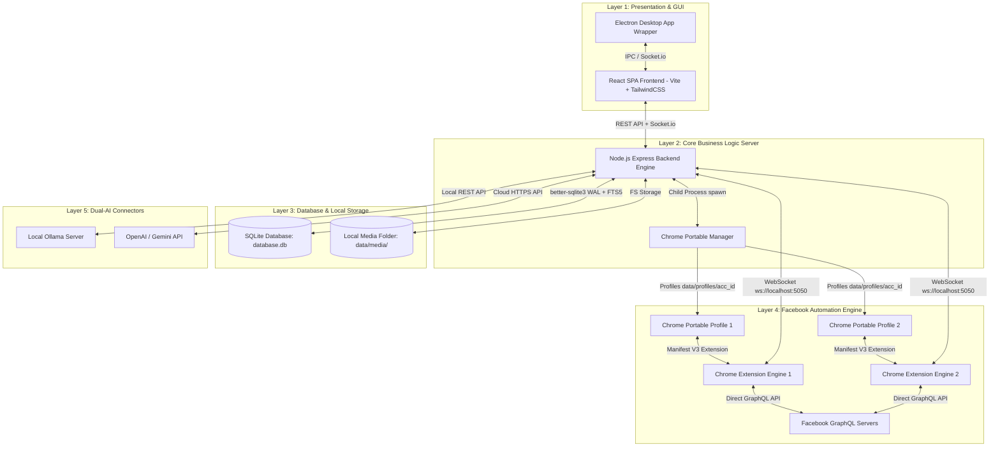

# KẾ HOẠCH KIẾN TRÚC KỸ THUẬT CHI TIẾT (TECHNICAL PLAN)
## DỰ ÁN: FB PERSONAL MESSENGER CRM (AUTOCHATBOT)

---

## 1. TỔNG QUAN KIẾN TRÚC & CÔNG NGHỆ (ARCHITECTURE & TECHSTACK)

Hệ thống được thiết kế theo kiến trúc **Decoupled Desktop App Architecture**, gồm 4 thành phần tách biệt giúp đạt độ tin cậy, bảo mật và hiệu năng cao nhất:



---

## 2. THIẾT KẾ CƠ SỞ DỮ LIỆU SQLITE (SQL DDL & INDICES)

Hệ thống sử dụng **`better-sqlite3`** với chế độ **WAL Mode (`PRAGMA journal_mode = WAL;`)** và **Synchronous Normal (`PRAGMA synchronous = NORMAL;`)** để đảm bảo tốc độ ghi cực nhanh mà không gây lock CSDL.

### DDL Script Khởi Tạo Bảng:

```sql
-- 1. Bảng Người dùng hệ thống (Admin / Staff)
CREATE TABLE IF NOT EXISTS users (
    id INTEGER PRIMARY KEY AUTOINCREMENT,
    username TEXT UNIQUE NOT NULL,
    password_hash TEXT NOT NULL,
    role TEXT CHECK(role IN ('ADMIN', 'STAFF')) NOT NULL DEFAULT 'STAFF',
    created_at DATETIME DEFAULT CURRENT_TIMESTAMP
);

-- 2. Bảng Tài khoản Facebook cá nhân
CREATE TABLE IF NOT EXISTS accounts (
    id TEXT PRIMARY KEY, -- FB User ID hoặc Email
    email TEXT,
    name TEXT NOT NULL,
    profile_dir TEXT NOT NULL,
    is_active BOOLEAN DEFAULT 1,
    broadcast_daily_count INTEGER DEFAULT 0,
    last_broadcast_date DATE DEFAULT (DATE('now')),
    status TEXT CHECK(status IN ('ACTIVE', 'DISCONNECTED', 'CHECKPOINT')) DEFAULT 'ACTIVE',
    created_at DATETIME DEFAULT CURRENT_TIMESTAMP
);

-- 3. Bảng Hội thoại (Threads)
CREATE TABLE IF NOT EXISTS threads (
    id TEXT PRIMARY KEY, -- FB Thread ID
    account_id TEXT NOT NULL,
    contact_name TEXT,
    last_message TEXT,
    last_activity DATETIME DEFAULT CURRENT_TIMESTAMP,
    is_unread BOOLEAN DEFAULT 1,
    status TEXT CHECK(status IN ('UNPROCESSED', 'ASSIGNED', 'COMPLETED')) DEFAULT 'UNPROCESSED',
    assigned_user_id INTEGER,
    ai_paused_until DATETIME,
    FOREIGN KEY(account_id) REFERENCES accounts(id) ON DELETE CASCADE,
    FOREIGN KEY(assigned_user_id) REFERENCES users(id) ON DELETE SET NULL
);

-- 4. Bảng Tin nhắn (Messages)
CREATE TABLE IF NOT EXISTS messages (
    id INTEGER PRIMARY KEY AUTOINCREMENT,
    thread_id TEXT NOT NULL,
    fb_message_id TEXT UNIQUE,
    sender_id TEXT NOT NULL,
    content TEXT,
    media_type TEXT CHECK(media_type IN ('text', 'image', 'video', 'voice', 'file')) DEFAULT 'text',
    media_url TEXT,
    local_media_path TEXT,
    is_outgoing BOOLEAN NOT NULL DEFAULT 0,
    is_unsent BOOLEAN NOT NULL DEFAULT 0,
    created_at DATETIME DEFAULT CURRENT_TIMESTAMP,
    FOREIGN KEY(thread_id) REFERENCES threads(id) ON DELETE CASCADE
);

-- 5. Bảng Tìm kiếm Toàn văn siêu tốc (FTS5 Virtual Table)
CREATE VIRTUAL TABLE IF NOT EXISTS messages_fts USING fts5(
    content,
    thread_id UNINDEXED,
    sender_id UNINDEXED,
    tokenize='unicode61'
);

-- Triggers tự động đồng bộ tin nhắn sang FTS5 Table
CREATE TRIGGER IF NOT EXISTS messages_ai AFTER INSERT ON messages BEGIN
    INSERT INTO messages_fts(rowid, content, thread_id, sender_id)
    VALUES (new.id, new.content, new.thread_id, new.sender_id);
END;

-- 6. Bảng Liên hệ / Lead khách hàng (Contacts)
CREATE TABLE IF NOT EXISTS contacts (
    thread_id TEXT PRIMARY KEY,
    name TEXT,
    avatar_url TEXT,
    phone TEXT,
    email TEXT,
    lead_captured BOOLEAN DEFAULT 0,
    tags TEXT DEFAULT '[]', -- JSON array format: ["VIP", "TuVan"]
    notes TEXT,
    FOREIGN KEY(thread_id) REFERENCES threads(id) ON DELETE CASCADE
);

-- 7. Bảng Cấu hình Auto Reply & AI
CREATE TABLE IF NOT EXISTS auto_replies (
    id INTEGER PRIMARY KEY AUTOINCREMENT,
    account_id TEXT NOT NULL,
    created_by_staff_id INTEGER,
    trigger_keyword TEXT NOT NULL,
    response_template TEXT NOT NULL,
    is_active BOOLEAN DEFAULT 1,
    FOREIGN KEY(account_id) REFERENCES accounts(id) ON DELETE CASCADE
);

CREATE TABLE IF NOT EXISTS ai_configs (
    id INTEGER PRIMARY KEY AUTOINCREMENT,
    account_id TEXT UNIQUE NOT NULL,
    provider TEXT CHECK(provider IN ('LOCAL_OLLAMA', 'CLOUD_OPENAI', 'CLOUD_GEMINI')) NOT NULL,
    api_key TEXT,
    model_name TEXT NOT NULL,
    system_prompt TEXT NOT NULL,
    is_active BOOLEAN DEFAULT 1,
    FOREIGN KEY(account_id) REFERENCES accounts(id) ON DELETE CASCADE
);

-- INDICES TỐI ƯU TRUY VẤN
CREATE INDEX IF NOT EXISTS idx_threads_account ON threads(account_id);
CREATE INDEX IF NOT EXISTS idx_threads_assigned ON threads(assigned_user_id);
CREATE INDEX IF NOT EXISTS idx_messages_thread ON messages(thread_id);
CREATE INDEX IF NOT EXISTS idx_messages_created ON messages(created_at);
```

---

## 3. THIẾT KẾ CÁC MÔ-ĐUN BACKEND CORE & LUỒNG XỬ LÝ (BACKEND ARCHITECTURE)

### 3.1. `ProcessManager` (Quản lý Chrome Portable ngầm)
- Sử dụng `child_process.spawn()` khởi chạy tiến trình Chrome Portable từ đường dẫn local: `bin/chrome-win/chrome.exe`.
- Cấu hình CLI flags tối ưu tài nguyên:
  `--user-data-dir=data/profiles/{account_id} --load-extension=bin/extension --disable-gpu --disable-software-rasterizer --no-first-run`.
- **Cơ chế Bật sáng Window khi Checkpoint:**
  Khi Backend nhận sự kiện `SESSION_EXPIRED` hoặc `CHECKPOINT_DETECTED` từ Extension, `ProcessManager` gọi lệnh script PowerShell/Win32 API đưa tiến trình Chrome Portable đó lên Foreground (`unhide & bring window to top`) để người dùng thao tác.

### 3.2. `SyncManager` (Xử lý Đồng bộ & Socket Server)
- Mở server WebSocket nội bộ tại `ws://localhost:5050` tiếp nhận kết nối từ Chrome Extension.
- **Luồng Đồng bộ ban đầu:**
  1. Extension lấy danh sách 100 threads gần nhất qua Facebook GraphQL API.
  2. Extension đẩy mảng JSON 100 threads về `SyncManager`.
  3. `SyncManager` sử dụng `better-sqlite3` transaction thực hiện `INSERT OR IGNORE` vào bảng `threads` và `contacts`.
- **Luồng Tin nhắn Mới & Media Downloader:**
  1. Extension bắt được tin nhắn mới từ Facebook WebSocket/GraphQL -> Đẩy về Backend.
  2. Nếu tin nhắn có chứa media đính kèm (image, video, voice, file), `MediaDownloader` thực hiện tải file qua HTTP ngầm lưu vào `data/media/{thread_id}/{timestamp}_{filename}` và lưu đường dẫn vào `MESSAGES.local_media_path`.

### 3.4. Onboarding & Account Session Management (Add Facebook Account Flow)
- **API Endpoint:** `POST /api/accounts/new-session`
  - Tạo `pending_key` ngẫu nhiên (ví dụ `pending_20260730_0922_xxx`).
  - Gọi `ProcessManager.startNewAccountProcess(pending_key)` để mở tiến trình Chrome Portable độc lập với `--user-data-dir=data/profiles/{pending_key}` và `--load-extension=src/extension` trỏ đến `https://www.facebook.com/messages`.
  - Trả về JSON `{ success: true, pending_key }`.
- **WebSocket Event Handshake `REGISTER_ACCOUNT`:**
  - Sau khi người dùng hoàn tất đăng nhập thủ công trên trình duyệt Chrome, Chrome Extension tự động đọc được `c_user` / `fb_dtsg` và thông tin tài khoản thật (`account_id`, `name`).
  - Extension phát sự kiện `REGISTER_ACCOUNT` qua WebSocket: `{ account_id, name, pending_key }`.
  - Backend nhận sự kiện, ghi nhận bản ghi mới vào CSDL `accounts` (`id = account_id, profile_dir = data/profiles/{account_id}`), tiến hành đổi tên/gán đường dẫn profile, và lưu kết nối `ws.accountId = account_id` vào `extensionConnections`.
  - Backend phát Socket.io `ACCOUNT_STATUS_CHANGED` & `EXTENSION_CONNECTION_CHANGED` về React UI.
  - Backend tự động gửi sự kiện `SYNC_THREADS` kích hoạt Extension đồng bộ 100 hội thoại gần nhất của tài khoản mới gộp thẳng vào Unified Inbox.
  3. Nếu khách bấm Thu hồi tin nhắn: Extension gửi event `MSG_UNSEND` -> Backend cập nhật `MESSAGES.is_unsent = 1`.

### 3.3. `BroadcastEngine` (Gửi tin nhắn hàng loạt An toàn)
- Quản lý gửi Broadcast với 2 rào cản an toàn:
  1. **Quota Check:** Kiểm tra `ACCOUNTS.broadcast_daily_count < 150`.
  2. **Random Delay:** Giữa 2 tin nhắn broadcast liên tiếp, engine sử dụng `setTimeout` với độ trễ ngẫu nhiên:
     `delay = Math.floor(Math.random() * (45000 - 15000 + 1)) + 15000;` (15 - 45 giây).

### 3.4. `AIMediator` (Quản lý Dual-AI & Auto-Pause 30 Phút)
- Khi nhận tin nhắn mới từ khách hàng:
  1. Kiểm tra `threads.ai_paused_until`: Nếu `now() < ai_paused_until` -> Tạm dừng không gọi AI.
  2. Nếu nhân viên thao tác gõ tin nhắn tay gửi sang khách: Backend lập tức set `threads.ai_paused_until = Date.now() + 30 * 60 * 1000`.
  3. Nếu AI hợp lệ: Gọi Connector tới Ollama (`http://localhost:11434/api/generate`) hoặc OpenAI/Gemini API -> Đẩy câu trả lời về Extension để gửi đi.

---

## 5. THIẾT KẾ KIẾN TRÚC GIAO DIỆN TRANG CHAT REDESIGN V1 (ENTERPRISE CRM UI)

### 5.1. Theme System: Day Rose / Night Ocean (Semantic CSS Variables)

Hệ thống UI áp dụng 2 Theme chính thức dựa trên semantic CSS variables trong `index.css`:

```css
/* Night Ocean (Default Dark) */
:root {
  --color-bg-app: #07111d;
  --color-bg-sidebar: #0b1624;
  --color-bg-panel: #0f1b2b;
  --color-bg-surface: #132235;
  --color-bg-elevated: #172b42;
  --color-border: #284057;

  --color-text-primary: #f8fafc;
  --color-text-secondary: #cbd5e1;
  --color-text-muted: #7f95aa;

  --color-accent: #0ea5e9;
  --color-accent-hover: #38bdf8;
  --color-accent-subtle: rgba(14, 165, 233, 0.14);

  --color-success: #10b981;
  --color-warning: #f59e0b;
  --color-danger: #ef4444;
}

/* Day Rose (Light Theme .light-theme) */
.light-theme {
  --color-bg-app: #fff7fa;
  --color-bg-sidebar: #fffafb;
  --color-bg-panel: #ffffff;
  --color-bg-surface: #fff1f5;
  --color-bg-elevated: #ffe7ef;
  --color-border: #f1cbd8;

  --color-text-primary: #182230;
  --color-text-secondary: #475569;
  --color-text-muted: #7c6671;

  --color-accent: #2563eb; /* Giữ xanh Messenger/CRM cho nút primary action */
  --color-accent-hover: #1d4ed8;
  --color-accent-subtle: rgba(219, 39, 119, 0.10);

  --color-success: #059669;
  --color-warning: #d97706;
  --color-danger: #dc2626;
}
```

- **Quy tắc:** Không hardcode class Tailwind dạng `bg-slate-900` hay `text-slate-400` trong component; dùng CSS variables hoặc custom utility classes map với CSS vars.
- **Toggle Button:** Nút chuyển đổi Theme nằm tại `AppSidebar.jsx` / `AppRail.jsx`, gọi `toggleTheme()` đã có sẵn trong `App.jsx`.

### 5.2. Layout Grid System & Components Mapping

```
+-------------------------------------------------------------------------------------------------------+
| [Rail 56px] | [Inbox Sidebar 360px]      | [Chat Header 64px]                   | [Customer Panel 360px]|
| (AppSidebar)| (ConversationSidebar)      | (ChatHeader.jsx)                     | (LeadDetailsPanel)    |
|-------------|----------------------------|--------------------------------------|-----------------------|
| - Chat (Act)| 1. Title & Sync Status     | Avatar - Name - Online - ID - Acc    | Customer Profile Card |
| - Search    | 2. Account Selector Dropdown| [Search] [OpenFB] | [Assign] [Chốt]  | Tab: [Info][Note][Hist|
| - Broadcast | 3. Search & Filters        | [AI Toggle + Pause Badge]            |                       |
| - AutoReply | (ConversationFilters.jsx)  | [Extension Indicator per Account]    | Contact Info:         |
| - AI Config |----------------------------|--------------------------------------| - Phone / Email       |
| - Accounts  | Conversation Item List:    | Message Area:                        | - Tags (Pills)        |
| - Settings  | (ConversationItem.jsx)     | (MessageList, MessageBubble, Media)  | CRM Status & Staff    |
| - Theme Tgl | - Avatar & Name & Time     | - Left: Customer (var(--bg-surface)) | Note Textarea         |
|             | - Preview & Acc Badge      | - Right: Staff / AI (var(--accent))  | [Save Note] [Export]  |
|             | - Status & Unread Badges   | - Unsent: Red Border (var(--danger)) |                       |
|             | (Alt+Up/Down shortcuts)    |--------------------------------------|                       |
|             |                            | Composer (MessageComposer.jsx):      |                       |
|             |                            | [+ Att] [Template] [Input...] [Send] |                       |
+-------------------------------------------------------------------------------------------------------+
```

### Chi tiết phân bổ Component React (Chỉnh sửa trên codebase hiện có):
1. **`AppSidebar.jsx` (hoặc `AppRail.jsx` + sửa import `App.jsx`):** Sửa thành rail 56px cố định lề trái, xử lý routing chính, icon navigation và nút **Toggle Theme (Sun/Moon)**.
2. **`ConversationSidebar.jsx` (360px):**
   - Header 3 tầng (Title/Sync, Multi-account Dropdown, Search `Ctrl/Cmd + K`).
   - Tích hợp `ConversationFilters.jsx` (`Tất cả`, `Của tôi`, `Chưa xử lý`, `Đã chốt`).
   - Tích hợp `ConversationItem.jsx` (Avatar, Name, Time, Last msg, Account Badge `FB Sales 01`, Status Badge, Unread count, hỗ trợ phím tắt `Alt + Up/Down`).
3. **`ChatArea.jsx` (Flexible Workspace):**
   - **`ChatHeader.jsx` [MODIFY]:** 3 nhóm nút (Tra cứu, Xử lý, AI Toggle + Pause Badge) + Realtime Extension Status Indicator lấy theo `selectedThread.account_id`.
   - **`MessageList.jsx` / `MessageBubble.jsx` / `MediaViewer.jsx` / `EmptyState.jsx` [MODIFY]:** Render bong bóng chat theo role (`var(--color-bg-surface)` vs `var(--color-accent)`), nhãn tin thu hồi viền đỏ mờ `var(--color-danger)`, xử lý trạng thái tin nhắn `sending` / `failed` / `sent` qua event `SEND_MESSAGE_RESULT`.
   - **`MessageComposer.jsx` [MODIFY]:** Khung soạn thảo nổi bật, Quick Template popup, tự động nhảy dòng (72px-144px), disable khi Extension disconnected.
### 5.3. Implementation Notes cho Developer

- **Scope Theme Token Migration:** Quy tắc không hardcode màu sắc áp dụng trước cho các component thuộc trang Chat Redesign V1; các modal cũ có thể xử lý ở phase sau.
- **Multi-account Dropdown:** Lấy dữ liệu thật từ `/api/accounts`, option label hiển thị `account.name || account.id` (không hardcode tên tài khoản).
- **Extension Status Indicator per Account:** Backend bổ sung trạng thái kết nối live theo account: trường `is_extension_connected` trong `/api/accounts` hoặc bắn Socket event `EXTENSION_CONNECTION_CHANGED`.
- **Định danh `client_message_id` & `server.js` WebSocket:** Thêm `client_message_id` khi Frontend emit `SEND_MESSAGE`. Backend forward ID này qua Extension. Bổ sung case `SEND_MESSAGE_RESULT` trong WebSocket handler của `server.js` để map `client_message_id` và phát `MESSAGE_SENT` / `MESSAGE_SEND_FAILED`.


