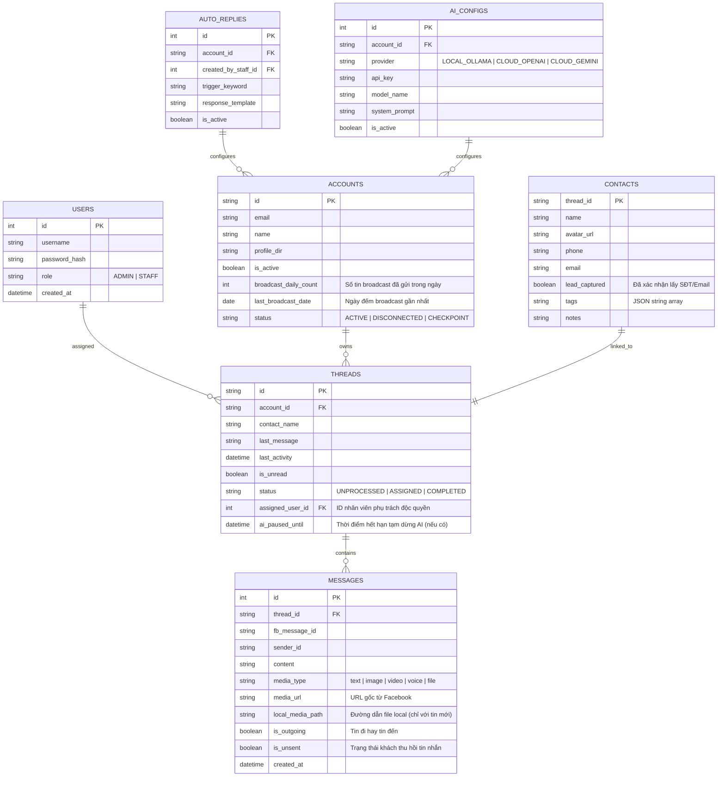

# TÀI LIỆU YÊU CẦU KỸ THUẬT CHI TIẾT (SPECIFICATION)
## DỰ ÁN: FB PERSONAL MESSENGER CRM (AUTOCHATBOT)

---

## 1. TỔNG QUAN VÀ TẦM NHÌN SẢN PHẨM (PROJECT OVERVIEW & VISION)

Hệ thống **FB Personal Messenger CRM** là ứng dụng Desktop dành cho hệ điều hành Windows, cho phép doanh nghiệp và đội ngũ nhân viên sales/cách chăm sóc khách hàng quản lý hàng loạt tài khoản Facebook cá nhân tập trung. Hệ thống hỗ trợ cào và gửi tin nhắn siêu tốc qua Facebook GraphQL API ngầm, bóc tách thông tin khách hàng (Lead Capture), phân quyền xử lý tin nhắn, gửi Broadcast an toàn và tự động hóa phản hồi bằng Dual-AI (Ollama Local & OpenAI/Gemini Cloud).

---

## 2. KIẾN TRÚC TỔNG THỂ HỆ THỐNG (SYSTEM ARCHITECTURE)

Hệ thống bao gồm 5 tầng thành phần chính:

1. **Client Application Layer (Electron Desktop App):**
   - Đóng gói ứng dụng Single Page Application React (Vite) + TailwindCSS.
   - Kết nối Realtime hai chiều với Backend Node.js qua Socket.io.
2. **Backend Core Layer (Node.js Express Engine):**
   - Quản lý các tiến trình ngầm `Chrome Portable` qua `child_process.spawn`.
   - Lập lịch nhiệm vụ (Job Scheduler), tính toán quota Broadcast, xử lý AI Auto-pause và quản lý CSDL SQLite.
3. **Chrome Engine Layer (Chrome Portable + Extension Manifest V3):**
   - Mỗi tài khoản Facebook chạy trên 1 tiến trình Chrome Portable độc lập với `user-data-dir` riêng.
   - Chrome Extension gọi trực tiếp Facebook GraphQL API (`fb_dtsg` token) để cào & gửi tin nhắn với tốc độ < 0.2s.
   - Gửi dữ liệu tin nhắn về Backend qua WebSocket nội bộ (`ws://localhost:5050`).
4. **Database Storage Layer (SQLite WAL Mode + FTS5):**
   - Lưu trữ dữ liệu dạng tệp nhị phân `.db` duy nhất.
   - Sử dụng chế độ **WAL (Write-Ahead Logging)** cho phép ghi đồng thời và **FTS5 (Full-Text Search)** cho phép tìm kiếm 1.000.000 tin nhắn trong 20ms.
5. **Dual-AI Engine Module:**
   - Kết nối linh hoạt giữa Local AI (Ollama API) và Cloud AI (OpenAI API / Gemini API).

---

## 3. MÔ HÌNH CƠ SỞ DỮ LIỆU CẬP NHẬT (UPDATED DATABASE SCHEMA)

---

## 4. ĐẶC TẢ CHI TIẾT TÍNH NĂNG CHỨC NĂNG (DETAILED FUNCTIONAL REQUIREMENTS)

### 4.1. Quản lý Tài khoản Facebook & Xử lý Ngoại lệ Session (Session & Account Exception)
1. **Đồng bộ ban đầu (Initial Sync):**
   - Khi thêm một tài khoản Facebook mới vào hệ thống: Chỉ đồng bộ danh sách **100 hội thoại gần nhất** và các tin nhắn **phát sinh mới** từ thời điểm thêm tài khoản.
2. **Luồng Thêm Tài khoản Facebook Mới từ UI (Add Facebook Account Onboarding):**
   - **Người dùng thao tác trên CRM UI:** Bấm nút `+ Thêm tài khoản Facebook` trong `AccountManagerModal.jsx` mà không cần biết trước `account_id` Facebook.
   - **Backend tạo Session tạm:** Backend gọi `POST /api/accounts/new-session`, sinh `pending_key` ngẫu nhiên (ví dụ `pending_20260730_0922_xxx`) và kích hoạt tiến trình `Chrome Portable` với `user-data-dir = data/profiles/{pending_key}` trỏ đến `https://www.facebook.com/messages`.
   - **Đăng nhập thủ công & Extension bắt Session:** Người dùng đăng nhập tài khoản Facebook trên cửa sổ Chrome. Chrome Extension tự động đọc `c_user` / `fb_dtsg` và thông tin tài khoản thật (`account_id`, `name`), sau đó gửi sự kiện `REGISTER_ACCOUNT` chứa `{ account_id, name, pending_key }` về Backend qua WebSocket.
   - **Khởi tạo & Gộp Inbox:** Backend ghi nhận tài khoản vào CSDL (`ACCOUNTS`), chuyển tên/gán thư mục profile chính thức (`data/profiles/{account_id}`), phát Socket.io `ACCOUNT_STATUS_CHANGED` để UI tự reload danh sách tài khoản, và tự động gọi `SYNC_THREADS` đồng bộ 100 hội thoại gần nhất gộp thẳng vào Inbox chung.
3. **Xử lý sự cố Đăng xuất / Checkpoint / 2FA:**
   - Khi Extension phát hiện cookie hết hạn, báo lỗi 401 hoặc Facebook bắt xác thực OTP 2FA / Checkpoint:
     - Hệ thống đổi trạng thái `ACCOUNTS.status = 'CHECKPOINT'`.
     - Backend điều khiển tiến trình `Chrome Portable` đang ẩn bật sáng giao diện window (`unhide Chrome GUI window`) để người dùng thao tác trực tiếp trên trình duyệt thật.
     - Sau khi người dùng đăng nhập thành công, Chrome Extension tự động phát hiện session hợp lệ, thông báo về Backend và ẩn cửa sổ Chrome ngầm trở lại.

### 4.2. Phân quyền & Độc quyền Nhân viên (Staff Concurrency & Assignment)
1. **Phụ trách độc quyền (Exclusive Assignment):**
   - Mỗi hội thoại tại một thời điểm chỉ gắn với **duy nhất 1 nhân viên** phụ trách (`THREADS.assigned_user_id`).
2. **Giao diện phân luồng Tabs:**
   - *Tab Tất cả tin nhắn:* Admin xem toàn bộ, Staff xem hội thoại được phân công + chưa phân công.
   - *Tab Được phân công (Assigned):* Chỉ chứa các hội thoại do chính nhân viên đăng nhập phụ trách.
   - *Tab Chưa xử lý (Unprocessed):* Các tin nhắn mới đổ về chưa có ai nhận phụ trách.
   - *Tab Đã chốt (Completed):* Các hội thoại đã hoàn thành giao dịch.

### 4.3. Quản lý Rich Media & Thu Hồi Tin Nhắn (Rich Media & Unsend Handling)
1. **Xem Rich Media trên UI Dashboard:**
   - Hỗ trợ hiển thị trực tiếp các loại media: Hình ảnh (lightbox xem ảnh lớn), Video (player phát video), Voice note (audio player có sóng âm), Tệp đính kèm (nút download file).
2. **Chính sách Tải ngầm Media về Local Storage:**
   - **Tin nhắn MỚI phát sinh:** Chrome Extension tự động tải file đính kèm về thư mục `data/media/` và lưu đường dẫn vào `MESSAGES.local_media_path`.
   - **Tin nhắn CŨ (100 hội thoại ban đầu):** Giữ nguyên URL gốc của Facebook (`MESSAGES.media_url`), không tải về ổ cứng local để tiết kiệm dung lượng đĩa và băng thông.
3. **Xử lý Tin nhắn Thu hồi (Unsent Messages):**
   - Khi khách hàng bấm "Thu hồi tin nhắn" trên Facebook Messenger:
     - Extension phát hiện sự kiện `message_unsend`.
     - Hệ thống **KHÔNG XÓA** bản ghi trong SQLite DB mà cập nhật `MESSAGES.is_unsent = true`.
     - Trên khung chat UI, tin nhắn thu hồi vẫn hiển thị nội dung kèm nhãn cảnh báo màu đỏ: **"Khách hàng đã thu hồi tin nhắn này"**.

### 4.4. Tự động hóa, Broadcast An toàn & AI Auto-Pause
1. **Giới hạn an toàn Broadcast (Safety Quota):**
   - Giới hạn tối đa **150 tin nhắn Broadcast / 1 tài khoản / 1 ngày** (`ACCOUNTS.broadcast_daily_count <= 150`).
   - Tự động Reset counter sau 24h (`last_broadcast_date`).
   - Thuật toán gửi hàng loạt áp dụng độ trễ ngẫu nhiên (Random Delay) từ **15 giây đến 45 giây** giữa mỗi tin nhắn để tránh bị Facebook khóa tính năng.
2. **Tự động tạm dừng AI Chatbot (AI Auto-Pause):**
   - Khi một khách hàng đang bật chế độ AI Chatbot tự động trả lời, nếu Nhân viên nhảy vào gõ tin nhắn trả lời thủ công:
     - Hệ thống cập nhật `THREADS.ai_paused_until = now() + 30 phút`.
     - Trong vòng 30 phút kể từ tin nhắn cuối của nhân viên, AI Chatbot sẽ tạm dừng hoàn toàn đối với hội thoại này.
     - Hết 30 phút nếu nhân viên không gõ thêm tin mới, AI Chatbot tự động kích hoạt trở lại.

---

### 4.5. Thiết Kế Giao Diện Trang Chat Redesign V1 (Enterprise Messenger CRM)

1. **Theme System: Day Rose & Night Ocean (Semantic CSS Variables):**
   - **Night Ocean (Default Dark):** Nền đen xanh biển sâu (`#07111d`), tương phản cao, phù hợp ban đêm.
     - `--color-bg-app`: `#07111d` | `--color-bg-sidebar`: `#0b1624` | `--color-bg-panel`: `#0f1b2b`
     - `--color-bg-surface`: `#132235` | `--color-bg-elevated`: `#172b42` | `--color-border`: `#284057`
     - `--color-text-primary`: `#f8fafc` | `--color-text-secondary`: `#cbd5e1` | `--color-text-muted`: `#7f95aa`
     - `--color-accent`: `#0ea5e9` | `--color-accent-hover`: `#38bdf8` | `--color-accent-subtle`: `rgba(14, 165, 233, 0.14)`
   - **Day Rose (Light Theme `.light-theme`):** Nền trắng phớt hồng (`#fff7fa`), sáng, sạch, không mỏi mắt khi dùng ban ngày.
     - `--color-bg-app`: `#fff7fa` | `--color-bg-sidebar`: `#fffafb` | `--color-bg-panel`: `#ffffff`
     - `--color-bg-surface`: `#fff1f5` | `--color-bg-elevated`: `#ffe7ef` | `--color-border`: `#f1cbd8`
     - `--color-text-primary`: `#182230` | `--color-text-secondary`: `#475569` | `--color-text-muted`: `#7c6671`
     - `--color-accent`: `#2563eb` *(xanh Messenger/CRM cho nút primary action)* | `--color-accent-hover`: `#1d4ed8` | `--color-accent-subtle`: `rgba(219, 39, 119, 0.10)`
   - **Quy tắc tuyệt đối:**
     - Toàn bộ màu sắc phải sử dụng qua CSS Variables trong `index.css`.
     - Không hardcode màu Tailwind kiểu `bg-slate-900`, `text-slate-400` trong component.
     - Tận dụng lại cơ chế `light-theme` class trên `<html>` đã có sẵn trong `App.jsx`.
     - Nút toggle theme (Sáng/Tối) nằm tại App Rail / `AppSidebar.jsx`.

2. **Cấu trúc Component & Layout Desktop (Tái cấu trúc trên Component hiện có):**
   - **Left App Rail / AppSidebar (56px):** Tái cấu trúc `AppSidebar.jsx` (hoặc `AppRail.jsx`) làm thanh điều hướng 56px với icon tooltip, active state vạch xanh lề trái và nút **Toggle Theme Sáng/Tối**.
   - **Inbox Sidebar (`ConversationSidebar.jsx` - 360px):**
     - Header 3 tầng: Title & Sync Status → Dropdown chọn tài khoản FB → Search (`Ctrl/Cmd + K`) & `ConversationFilters.jsx` (`Tất cả`, `Của tôi`, `Chưa xử lý`, `Đã chốt`).
     - Item (`ConversationItem.jsx`): Avatar + Tên khách + Time + Preview tin nhắn + Multi-account badge (`FB Sales 01`) + Status badge + Unread count. Cho phép dùng phím tắt `Alt + Up/Down` di chuyển giữa các hội thoại.
   - **Chat Main (`ChatArea.jsx` - Flexible Workspace):**
     - Header (`ChatHeader.jsx` - 64px): Profile khách hàng (Avatar, Tên, Status, ID, Account badge) + Indicator kết nối Extension theo `selectedThread.account_id` + 3 nhóm nút hành động (Tra cứu: Search/OpenFB | Xử lý: Assign/Chốt | Automation: AI Toggle + Badge tạm dừng).
     - Message List (`MessageList.jsx`, `MessageBubble.jsx`, `MediaViewer.jsx`, `EmptyState.jsx`): Empty state hữu ích khi rỗng. Phân biệt màu sắc tin nhắn (Khách trái `var(--color-bg-surface)`, Nhân viên/AI phải `var(--color-accent)`). Giữ tin nhắn thu hồi với viền đỏ nhẹ `var(--color-danger)`.
     - Composer (`MessageComposer.jsx` - Min 72px, Max 144px): Quick template button, attachment, input >= 44px, nút Send 44x44. Disable & hiển thị cảnh báo khi Extension mất kết nối.
   - **Customer Panel (`LeadDetailsPanel.jsx` - 360px):**
     - Tái cấu trúc giao diện khoảng thở rộng rãi (gap 16px, input cao 40px), Tabs (`[Thông tin]`, `[Ghi chú]`, `[Lịch sử]`), SĐT/Email/Tags, Trạng thái lead & Staff phụ trách, Textarea ghi chú + Save/Export.

3. **Logic Trạng thái Tin nhắn & 10 Edge States Bắt buộc:**
   - **Xử lý Pending/Failed/Sent Tin nhắn:** Cần mở rộng cả Backend & Frontend xử lý sự kiện `SEND_MESSAGE_RESULT` từ Extension: khi gõ gửi tin -> UI render trạng thái `sending` (opacity/spinner) -> khi nhận result `success: true` -> chuyển `sent`, nếu `error` -> chuyển `failed` kèm nút Retry.
   - **10 Edge States:** `Loading threads`, `No account connected`, `Account checkpoint`, `Extension disconnected`, `Thread empty`, `Message sending`, `Send failed`, `AI paused`, `New unread message`, `Lead extracted`.

---

### 4.6. Implementation Notes cho Developer (Triển Khai Thực Tế)

- **Scope Migration Theme Token:** Quy tắc không hardcode màu chỉ bắt buộc áp dụng trước cho các component thuộc trang Chat Redesign V1; các modal cũ (`AccountManagerModal`, `BroadcastModal`, `AutoReplyModal`, `AiConfigModal`) sẽ xử lý ở phase sau để tránh phình phạm vi công việc.
- **Multi-Account Dropdown Data:** Lấy dữ liệu thật từ `/api/accounts`, hiển thị tên lựa chọn bằng `account.name || account.id` (không hardcode dữ liệu mẫu).
- **Trạng thái Realtime Extension per Account:** Backend bổ sung trường `is_extension_connected` trong API `/api/accounts` hoặc phát sự kiện Socket `EXTENSION_CONNECTION_CHANGED` để Frontend cập nhật chính xác đèn báo kết nối theo `selectedThread.account_id`.
- **Định danh `client_message_id` cho Tin nhắn & Backend WebSocket Handler:**
  - Khi Frontend gửi tin nhắn, tự động tạo `client_message_id` tạm thời.
  - Backend forward ID này qua Extension.
  - **BẮT BUỘC:** Thêm case `SEND_MESSAGE_RESULT` trong WebSocket handler của `server.js` để map `client_message_id` và phát sự kiện Socket `MESSAGE_SENT` / `MESSAGE_SEND_FAILED` để Frontend cập nhật trạng thái `sending` → `sent` / `failed` lên đúng bong bóng chat tương ứng.

1. **Hiệu năng & Tìm kiếm siêu tốc:**
   - SQLite bật `WAL Mode` và bảng ảo `MESSAGES_FTS` (FTS5). Thời gian truy vấn từ khóa trong 1.000.000 tin nhắn < 30ms.
2. **Bảo mật Source Code & Dữ liệu:**
   - Biên dịch Backend Node.js sang V8 Bytecode nhị phân (`bytenode`).
   - Làm rối mã nguồn Chrome Extension bằng `javascript-obfuscator`.
   - Mã hóa tài khoản & thông tin nhạy cảm trong SQLite DB.
3. **Quản lý Tài nguyên Tiến trình:**
   - Mỗi tiến trình `Chrome Portable` ngầm được tối ưu bằng các cờ `--disable-gpu --disable-software-rasterizer --no-first-run` để giữ mức RAM tiêu thụ < 250MB/profile.
